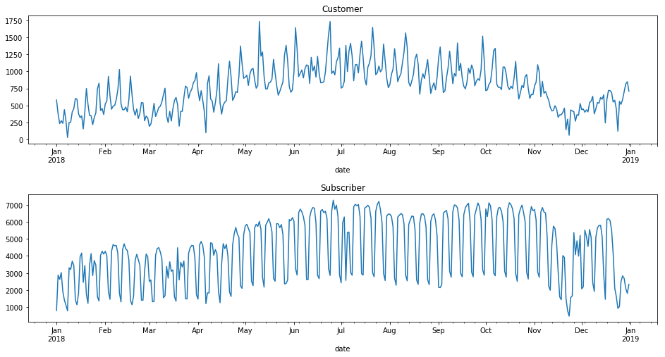
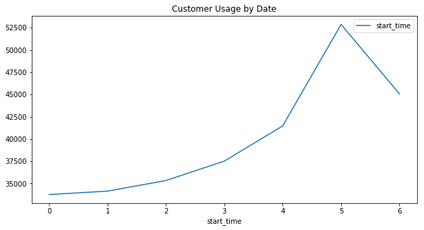
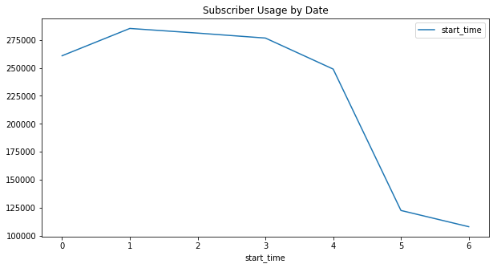
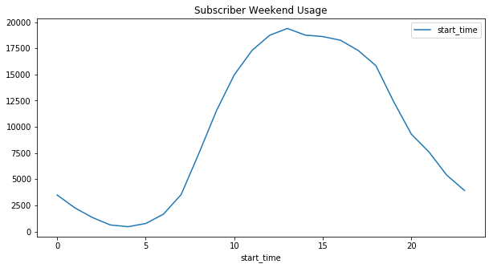
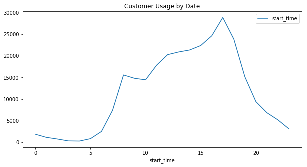
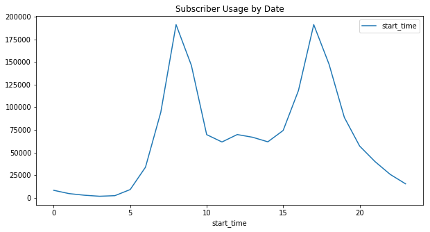
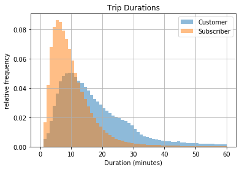

```python
# import all packages and set plots to be embedded inline
import numpy as np
import pandas as pd
import matplotlib.pyplot as plt
import datetime as dt
import seaborn as sns
import glob
%matplotlib inline
```

**Data Collection and Wrangling**


```python
#Aggregate data into a single Data Frame
df = pd.concat([pd.read_csv(f) for f in glob.glob('*.csv')], ignore_index = True)
df.info()
```

    <class 'pandas.core.frame.DataFrame'>
    RangeIndex: 1863721 entries, 0 to 1863720
    Data columns (total 16 columns):
    duration_sec               int64
    start_time                 object
    end_time                   object
    start_station_id           float64
    start_station_name         object
    start_station_latitude     float64
    start_station_longitude    float64
    end_station_id             float64
    end_station_name           object
    end_station_latitude       float64
    end_station_longitude      float64
    bike_id                    int64
    user_type                  object
    member_birth_year          float64
    member_gender              object
    bike_share_for_all_trip    object
    dtypes: float64(7), int64(2), object(7)
    memory usage: 227.5+ MB


```python
#format data structure
df['start_time'] = pd.to_datetime(df['start_time'])
df['end_time'] = pd.to_datetime(df['end_time'])
df['start_time_month'] = df['start_time'].dt.month
df['start_time_day_of_week'] = df['start_time'].dt.weekday_name
df['start_time_hour'] = df['start_time'].dt.hour
df['duration_min'] = df['duration_sec']/60

```


```python
df.fillna(0, inplace=True)
df.head()
```


<div>
<style scoped>
    .dataframe tbody tr th:only-of-type {
        vertical-align: middle;
    }

    .dataframe tbody tr th {
        vertical-align: top;
    }

    .dataframe thead th {
        text-align: right;
    }
</style>
<table border="1" class="dataframe">
  <thead>
    <tr style="text-align: right;">
      <th></th>
      <th>duration_sec</th>
      <th>start_time</th>
      <th>end_time</th>
      <th>start_station_id</th>
      <th>start_station_name</th>
      <th>start_station_latitude</th>
      <th>start_station_longitude</th>
      <th>end_station_id</th>
      <th>end_station_name</th>
      <th>end_station_latitude</th>
      <th>end_station_longitude</th>
      <th>bike_id</th>
      <th>user_type</th>
      <th>member_birth_year</th>
      <th>member_gender</th>
      <th>bike_share_for_all_trip</th>
      <th>start_time_month</th>
      <th>start_time_day_of_week</th>
      <th>start_time_hour</th>
      <th>duration_min</th>
    </tr>
  </thead>
  <tbody>
    <tr>
      <th>0</th>
      <td>598</td>
      <td>2018-02-28 23:59:47.097</td>
      <td>2018-03-01 00:09:45.187</td>
      <td>284.0</td>
      <td>Yerba Buena Center for the Arts (Howard St at ...</td>
      <td>37.784872</td>
      <td>-122.400876</td>
      <td>114.0</td>
      <td>Rhode Island St at 17th St</td>
      <td>37.764478</td>
      <td>-122.402570</td>
      <td>1035</td>
      <td>Subscriber</td>
      <td>1988.0</td>
      <td>Male</td>
      <td>No</td>
      <td>2</td>
      <td>Wednesday</td>
      <td>23</td>
      <td>9.966667</td>
    </tr>
    <tr>
      <th>1</th>
      <td>943</td>
      <td>2018-02-28 23:21:16.495</td>
      <td>2018-02-28 23:36:59.974</td>
      <td>6.0</td>
      <td>The Embarcadero at Sansome St</td>
      <td>37.804770</td>
      <td>-122.403234</td>
      <td>324.0</td>
      <td>Union Square (Powell St at Post St)</td>
      <td>37.788300</td>
      <td>-122.408531</td>
      <td>1673</td>
      <td>Customer</td>
      <td>1987.0</td>
      <td>Male</td>
      <td>No</td>
      <td>2</td>
      <td>Wednesday</td>
      <td>23</td>
      <td>15.716667</td>
    </tr>
    <tr>
      <th>2</th>
      <td>18587</td>
      <td>2018-02-28 18:20:55.190</td>
      <td>2018-02-28 23:30:42.925</td>
      <td>93.0</td>
      <td>4th St at Mission Bay Blvd S</td>
      <td>37.770407</td>
      <td>-122.391198</td>
      <td>15.0</td>
      <td>San Francisco Ferry Building (Harry Bridges Pl...</td>
      <td>37.795392</td>
      <td>-122.394203</td>
      <td>3498</td>
      <td>Customer</td>
      <td>1986.0</td>
      <td>Female</td>
      <td>No</td>
      <td>2</td>
      <td>Wednesday</td>
      <td>18</td>
      <td>309.783333</td>
    </tr>
    <tr>
      <th>3</th>
      <td>18558</td>
      <td>2018-02-28 18:20:53.621</td>
      <td>2018-02-28 23:30:12.450</td>
      <td>93.0</td>
      <td>4th St at Mission Bay Blvd S</td>
      <td>37.770407</td>
      <td>-122.391198</td>
      <td>15.0</td>
      <td>San Francisco Ferry Building (Harry Bridges Pl...</td>
      <td>37.795392</td>
      <td>-122.394203</td>
      <td>3129</td>
      <td>Customer</td>
      <td>1981.0</td>
      <td>Male</td>
      <td>No</td>
      <td>2</td>
      <td>Wednesday</td>
      <td>18</td>
      <td>309.300000</td>
    </tr>
    <tr>
      <th>4</th>
      <td>885</td>
      <td>2018-02-28 23:15:12.858</td>
      <td>2018-02-28 23:29:58.608</td>
      <td>308.0</td>
      <td>San Pedro Square</td>
      <td>37.336802</td>
      <td>-121.894090</td>
      <td>297.0</td>
      <td>Locust St at Grant St</td>
      <td>37.322980</td>
      <td>-121.887931</td>
      <td>1839</td>
      <td>Subscriber</td>
      <td>1976.0</td>
      <td>Female</td>
      <td>Yes</td>
      <td>2</td>
      <td>Wednesday</td>
      <td>23</td>
      <td>14.750000</td>
    </tr>
  </tbody>
</table>
</div>


**Data Analysis**

*** Bike Usage Frequency and Duration by month, day and hour***


```python
ind = pd.DatetimeIndex(df.start_time)
df['date'] = ind.date.astype('datetime64')
df['hour'] = ind.hour
df['dayofweek']=ind.dayofweek
by_date = df.pivot_table(aggfunc='count',
                            index='date',
                            columns='user_type')
fig, ax = plt.subplots(2, figsize=(16, 8))
fig.subplots_adjust(hspace=0.4)
by_date.iloc[:, 0].plot(ax=ax[0], title='Customer');
by_date.iloc[:, 1].plot(ax=ax[1], title='Subscriber');

```





```python
df.start_time_day_of_week.value_counts()
```


    Tuesday      319332
    Wednesday    316374
    Thursday     314124
    Monday       294573
    Friday       290390
    Saturday     175614
    Sunday       153314
    Name: start_time_day_of_week, dtype: int64


```python
df.start_time_hour.value_counts()
```


    17    220014
    8     206729
    18    171335
    9     160974
    16    143045
    19    103930
    7     101793
    15     96747
    12     90140
    13     87780
    10     84232
    14     83207
    11     79511
    20     66566
    21     46956
    6      36359
    22     31056
    23     18645
    0      10234
    5      10027
    1       5884
    2       3697
    4       2740
    3       2120
    Name: start_time_hour, dtype: int64


```python
customer_usage_week = df.groupby(df[df["user_type"] == "Customer"]['start_time'].dt.dayofweek).count()
Subscriber_usage_week = df.groupby(df[df["user_type"] == "Subscriber"]['start_time'].dt.dayofweek).count()
customer_usage_week.plot.line(x=customer_usage_week.index, y = "start_time", figsize = [10,5], title='Customer Usage by Date')
Subscriber_usage_week.plot.line(x=Subscriber_usage_week.index, y = "start_time",figsize = [10,5], title='Subscriber Usage by Date')
```


    <matplotlib.axes._subplots.AxesSubplot at 0x1a285ab080>








```python
Subscriber_usage_weekend.plot.line(x=Subscriber_usage_weekend.index, y = 'start_time',figsize = [10,5], title='Subscriber Weekend Usage')
```


    <matplotlib.axes._subplots.AxesSubplot at 0x1a285c9cc0>





```python
customer_usage_week_hour = df.groupby(df[df["user_type"] == "Customer"]['start_time'].dt.hour).count()
Subscriber_usage_week_hour = df.groupby(df[df["user_type"] == "Subscriber"]['start_time'].dt.hour).count()
customer_usage_week_hour.plot.line(x=customer_usage_week_hour.index, y = 'start_time',figsize = [10,5], title='Customer Usage by Date')
Subscriber_usage_week_hour.plot.line(x=Subscriber_usage_week_hour.index, y = 'start_time',figsize = [10,5], title='Subscriber Usage by Date')
```


    <matplotlib.axes._subplots.AxesSubplot at 0x1a2419c6d8>








***Bike Usage Frequency by User Type and Gender***


```python
df.groupby("user_type").start_time.count()
```


    user_type
    Customer       280167
    Subscriber    1583554
    Name: start_time, dtype: int64


```python
df.groupby("user_type").start_time.count()/df.shape[0]
```


    user_type
    Customer      0.150327
    Subscriber    0.849673
    Name: start_time, dtype: float64


```python
df[df["member_gender"]=="Male"].start_time.count()/df[df["member_gender"]=="Female"].start_time.count()
```


    2.9395715994048217


*** Bike Usage Trip Duration Analysis***


```python
average_duration = df.duration_min.sum()/df.shape[0]
average_duration
```


    14.288376183988916


```python
df.groupby("user_type")['duration_min'].mean()
```


    user_type
    Customer      32.046325
    Subscriber    11.146588
    Name: duration_min, dtype: float64


```python
df.groupby("member_gender")[['duration_min']].mean()
```


<div>
<style scoped>
    .dataframe tbody tr th:only-of-type {
        vertical-align: middle;
    }

    .dataframe tbody tr th {
        vertical-align: top;
    }

    .dataframe thead th {
        text-align: right;
    }
</style>
<table border="1" class="dataframe">
  <thead>
    <tr style="text-align: right;">
      <th></th>
      <th>duration_min</th>
    </tr>
    <tr>
      <th>member_gender</th>
      <th></th>
    </tr>
  </thead>
  <tbody>
    <tr>
      <th>0</th>
      <td>35.322539</td>
    </tr>
    <tr>
      <th>Female</th>
      <td>15.029508</td>
    </tr>
    <tr>
      <th>Male</th>
      <td>12.229892</td>
    </tr>
    <tr>
      <th>Other</th>
      <td>14.482978</td>
    </tr>
  </tbody>
</table>
</div>


```python
df.groupby(['user_type', 'member_gender'])['duration_min'].aggregate('mean').unstack()
```


<div>
<style scoped>
    .dataframe tbody tr th:only-of-type {
        vertical-align: middle;
    }

    .dataframe tbody tr th {
        vertical-align: top;
    }

    .dataframe thead th {
        text-align: right;
    }
</style>
<table border="1" class="dataframe">
  <thead>
    <tr style="text-align: right;">
      <th>member_gender</th>
      <th>0</th>
      <th>Female</th>
      <th>Male</th>
      <th>Other</th>
    </tr>
    <tr>
      <th>user_type</th>
      <th></th>
      <th></th>
      <th></th>
      <th></th>
    </tr>
  </thead>
  <tbody>
    <tr>
      <th>Customer</th>
      <td>45.483659</td>
      <td>30.222535</td>
      <td>25.289923</td>
      <td>26.132144</td>
    </tr>
    <tr>
      <th>Subscriber</th>
      <td>10.917875</td>
      <td>12.428703</td>
      <td>10.712162</td>
      <td>12.410044</td>
    </tr>
  </tbody>
</table>
</div>


```python
df[df['duration_min'] >=30].start_time.count()/df.start_time.count()
```


    0.051138019048988556


```python
df[df['duration_min'] >=30].user_type.value_counts()
```


    Customer      54033
    Subscriber    41274
    Name: user_type, dtype: int64


```python
df[df['duration_min'] >=30].member_gender.value_counts()
```


    Male      46334
    0         24050
    Female    23434
    Other      1489
    Name: member_gender, dtype: int64


```python
df[df['duration_min'] >=30].user_type.value_counts()/df[df['duration_min'] >=30].start_time.count()
```


    Customer      0.566936
    Subscriber    0.433064
    Name: user_type, dtype: float64


```python
df[df['duration_min'] >=30].start_time_month.value_counts()
```


    7     12244
    6     11268
    9     10762
    8     10073
    5      9388
    10     9069
    4      6546
    12     6305
    3      5248
    11     5229
    2      4892
    1      4283
    Name: start_time_month, dtype: int64


```python
df[df['duration_min'] >=30].start_time_day_of_week.value_counts()
```


    Saturday     19487
    Sunday       17544
    Friday       13213
    Monday       11551
    Thursday     11522
    Wednesday    11147
    Tuesday      10843
    Name: start_time_day_of_week, dtype: int64


```python
df[df['duration_min'] >=30].start_time_hour.value_counts()
```


    12    8693
    15    8540
    14    8529
    17    8396
    13    8324
    16    8168
    11    7299
    18    6710
    10    5308
    19    4777
    9     4104
    8     3491
    20    2989
    21    2211
    7     1787
    22    1575
    23    1025
    6      807
    0      739
    1      599
    2      397
    5      343
    3      267
    4      229
    Name: start_time_hour, dtype: int64


```python
df[df['duration_min'] >=30].member_gender.value_counts()
```


    Male      46334
    0         24050
    Female    23434
    Other      1489
    Name: member_gender, dtype: int64


```python
df.groupby('user_type')['duration_min'].hist(bins=np.arange(61), alpha=0.5, normed=True);
plt.xlabel('Duration (minutes)')
plt.ylabel('relative frequency')
plt.title('Trip Durations')
plt.legend(['Customer', 'Subscriber'])
```


    <matplotlib.legend.Legend at 0x1a2920ea58>





***Start and End Station Analysis***


```python
df.start_station_name.describe()
```


    count                                               1863721
    unique                                                  349
    top       San Francisco Ferry Building (Harry Bridges Pl...
    freq                                                  38461
    Name: start_station_name, dtype: object


```python
df.end_station_name.describe()
```


    count                                               1863721
    unique                                                  349
    top       San Francisco Caltrain Station 2  (Townsend St...
    freq                                                  50000
    Name: end_station_name, dtype: object


```python
df.start_station_name.value_counts().head(1)
```


    San Francisco Ferry Building (Harry Bridges Plaza)    38461
    Name: start_station_name, dtype: int64


```python
df.start_station_name.value_counts().head(1)/df.shape[0]
```


    San Francisco Ferry Building (Harry Bridges Plaza)    0.020637
    Name: start_station_name, dtype: float64


```python
df.start_station_name.value_counts().tail(1)
```


    2nd St at S Park St    11
    Name: start_station_name, dtype: int64


```python
df.end_station_name.value_counts().head()
```


    San Francisco Caltrain Station 2  (Townsend St at 4th St)    50000
    San Francisco Ferry Building (Harry Bridges Plaza)           44113
    San Francisco Caltrain (Townsend St at 4th St)               42970
    The Embarcadero at Sansome St                                39222
    Montgomery St BART Station (Market St at 2nd St)             35955
    Name: end_station_name, dtype: int64


```python
df.end_station_name.value_counts().head(1)
```


    San Francisco Caltrain Station 2  (Townsend St at 4th St)    50000
    Name: end_station_name, dtype: int64


```python
df.end_station_name.value_counts().head(1)/df.shape[0]
```


    San Francisco Caltrain Station 2  (Townsend St at 4th St)    0.026828
    Name: end_station_name, dtype: float64


```python
df.end_station_name.value_counts().tail(1)
```


    Farnam St at Fruitvale Ave    12
    Name: end_station_name, dtype: int64


***The Most and Least Usage Bike Analysis***


```python
df.bike_id.value_counts().head(1)
```


    3961    1220
    Name: bike_id, dtype: int64


```python
df.bike_id.value_counts().head(1)/df.shape[0]
```


    3961    0.000655
    Name: bike_id, dtype: float64


```python
df[df.bike_id == 3961].start_station_name.value_counts().head()
```


    The Embarcadero at Sansome St                                29
    Powell St BART Station (Market St at 4th St)                 27
    Berry St at 4th St                                           27
    San Francisco Caltrain Station 2  (Townsend St at 4th St)    26
    Montgomery St BART Station (Market St at 2nd St)             26
    Name: start_station_name, dtype: int64


```python
df[df.bike_id == 3961].end_station_name.value_counts().head()
```


    The Embarcadero at Sansome St                       28
    Powell St BART Station (Market St at 4th St)        28
    Berry St at 4th St                                  27
    Market St at 10th St                                26
    Montgomery St BART Station (Market St at 2nd St)    26
    Name: end_station_name, dtype: int64


```python
df.bike_id.value_counts().tail(1)
```


    4085    1
    Name: bike_id, dtype: int64


```python

```


```python
df[df.user_type == "Subscriber"].start_station_name.value_counts()
```


    San Francisco Caltrain Station 2  (Townsend St at 4th St)          34407
    San Francisco Caltrain (Townsend St at 4th St)                     31529
    Market St at 10th St                                               30874
    Berry St at 4th St                                                 29905
    Montgomery St BART Station (Market St at 2nd St)                   28087
    San Francisco Ferry Building (Harry Bridges Plaza)                 26881
    Powell St BART Station (Market St at 4th St)                       25378
    Howard St at Beale St                                              24549
    Steuart St at Market St                                            24296
    The Embarcadero at Sansome St                                      21664
    Powell St BART Station (Market St at 5th St)                       20055
    Embarcadero BART Station (Beale St at Market St)                   19553
    3rd St at Townsend St                                              18655
    Townsend St at 7th St                                              16810
    Beale St at Harrison St                                            16276
    4th St at Mission Bay Blvd S                                       15671
    19th Street BART Station                                           15031
    2nd St at Townsend St                                              14732
    Civic Center/UN Plaza BART Station (Market St at McAllister St)    14586
    The Embarcadero at Steuart St                                      13475
    Post St at Kearny St                                               13281
    Bancroft Way at College Ave                                        12781
    Valencia St at 24th St                                             12040
    2nd St at Folsom St                                                11676
    MacArthur BART Station                                             11557
    Esprit Park                                                        11028
    Spear St at Folsom St                                              10815
    8th St at Ringold St                                               10721
    San Francisco Public Library (Grove St at Hyde St)                 10697
    Mechanics Monument Plaza (Market St at Bush St)                    10530
                                                                       ...  
    Woolsey St at Sacramento St1                                         231
    26th Ave at International Blvd                                       202
    E 12th St at 4th Ave                                                 180
    20th St at Dolores St                                                176
    MLK Jr Way at 36th St (Temporary Location)                           170
    Guerrero Park                                                        168
    Oak St at 1st St                                                     156
    Foothill Blvd at 42nd Ave                                            149
    Lane St at Revere Ave                                                127
    Tamien Station                                                       125
    16th St Depot                                                        124
    Fruitvale Ave at International Blvd                                  118
    Palm St at Willow St                                                 117
    W St John St at Guadalupe River Trail                                110
    E 12th St at 6th Ave                                                 106
    Outside Lands 2018 (Temporary Station)                               101
    Empire St at 7th St                                                   99
    Newhall St at 3rd St                                                  86
    21st Ave at International Blvd                                        80
    Williams Ave at Apollo St                                             73
    Laguna St at McAllister St                                            73
    Masonic Ave at Turk St                                                69
    Willow St at Vine St                                                  64
    Mendell St at Fairfax Ave                                             48
    William St at 4th St (Temporary Location)                             24
    Lane St at Van Dyke Ave                                               21
    Williams Ave at 3rd St                                                13
    Farnam St at Fruitvale Ave                                            10
    2nd St at S Park St                                                    8
    Viva Calle SJ                                                          1
    Name: start_station_name, Length: 349, dtype: int64


*** Rider Age Analysis***


```python
latest_birth_year = str(int(df['member_birth_year'].max()))
```


```python
latest_birth_year
```


    '2000'


```python
(2019 - df['member_birth_year'].astype(int)).value_counts().index[1]
```


    31


```python
(2019 - df['member_birth_year'].astype(int)).value_counts().head(2)
```


    2019    110718
    31      102836
    Name: member_birth_year, dtype: int64


```python
(2019 - df['member_birth_year'].astype(int)).value_counts().head(2)/df.shape[0]
```


    2019    0.059407
    31      0.055178
    Name: member_birth_year, dtype: float64


```python
(2019 - df['member_birth_year'].astype(int)).value_counts().tail(1)
```


    89    1
    Name: member_birth_year, dtype: int64


```python
(2019 - df['member_birth_year'].astype(int)).min()
```


    19


```python

```


```python

```
